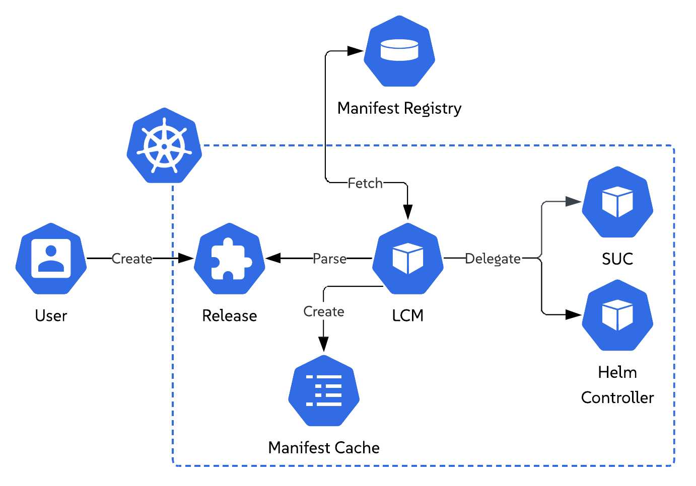
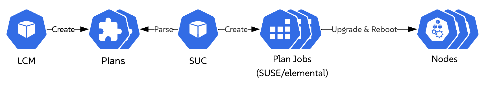
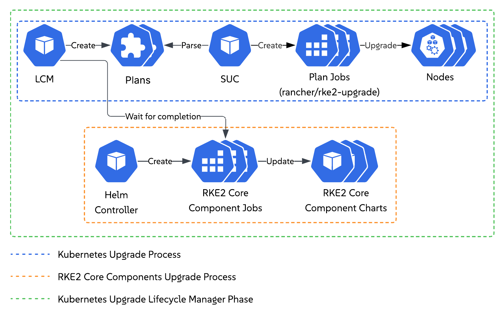
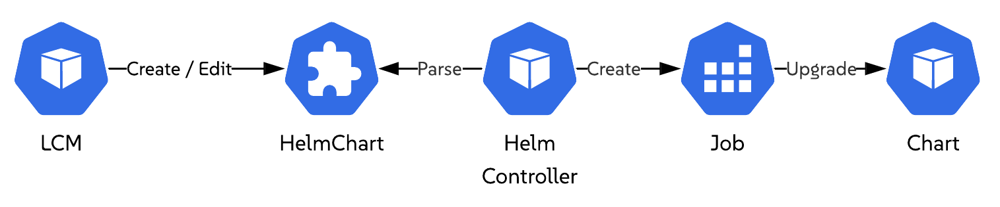

# Elemental Lifecycle Manager Upgrade Process

Elemental Lifecycle Manager (LCM) introduces a new `Release` custom resource that describes the desired state of an environment after upgrade.

Once a `Release` resource is deployed or updated, LCM parses it and retrieves the referenced [release manifest](https://github.com/SUSE/elemental/blob/main/docs/release-manifest.md). This manifest defines the desired upgrade state of the environment. LCM stores a copy of said manifest in a local cache, for future reference.

After parsing the desired environment state, LCM begins the upgrade process, which consists of the following upgrade phases:

1. Operating system (SLES)
2. Kubernetes distribution (RKE2)
3. Additional components (Helm charts)

For each upgrade phase, LCM orchestrates the workflow and delegates execution to either the [System Upgrade Controller](https://github.com/rancher/system-upgrade-controller/tree/master) or the [Helm Controller](https://github.com/k3s-io/helm-controller). This allows LCM to reuse proven Kubernetes controllers while providing a standardized single entry point for the full environment upgrade process.

Below you can find further information on the intricacies of each upgrade phase.

## Operating System Upgrade Phase

> NOTE: By default, LCM drains nodes during an operating system upgrade when the corresponding node group has more than one instance. To disable node draining entirely, set `spec.disableDrain` to `true` on the [`Release`](release-api.md#spec) resource.

For this phase, LCM proceeds to create [SUC Plans](https://github.com/rancher/system-upgrade-controller/tree/master#api-documentation) for the `control-plane` and `worker` node upgrades. These plans specify the operations that each SUC created workload must perform, as well as the nodes on which they should be applied. 

LCM deploys the aforementioned `SUC Plans` in **sequence**, where the `worker` node plan is **only** deployed if the `control-plane` node plan has been marked as completed, signaling that all `control-plane` nodes are successfully upgraded.

After each plan is deployed, SUC creates the corresponding upgrade workloads for the targeted node group. Each workload handles a single node, and SUC creates them **sequentially**, ensuring that nodes within the group are upgraded one at a time. Each created workload uses the [SUSE/elemental](https://github.com/SUSE/elemental/tree/main) tool stack to perform the necessary upgrade steps.

A successful node operating system upgrade is indicated by the node rebooting and becoming available again. Once this happens, SUC creates the workload for the next node. The operating system upgrade phase is marked as `Completed` only after all `control-plane` and `worker` workloads complete successfully.

## Kubernetes Upgrade Phase

> NOTE: By default, LCM drains nodes during a Kubernetes upgrade when the corresponding node group has more than one instance. To disable node draining entirely, set `spec.disableDrain` to `true` on the [`Release`](release-api.md#spec) resource.

This phase happens in two stages:

1. Kubernetes version upgrade
2. Kubernetes packaged components upgrade validation

For the Kubernetes version upgrade, LCM proceeds to create [SUC Plans](https://github.com/rancher/system-upgrade-controller/tree/master#api-documentation) for the `control-plane` and `worker` node upgrades. These plans specify the operations that each SUC created workload must perform, as well as the nodes on which they should be applied. 

LCM deploys the aforementioned `SUC Plans` in **sequence**, where the `worker` node plan is **only** deployed if the `control-plane` node plan has been marked as completed, signaling that all `control-plane` nodes are successfully upgraded.

After each plan is deployed, SUC creates the corresponding upgrade workloads for the targeted node group. Each workload handles a single node, and SUC creates them **sequentially**, ensuring that nodes within the group are upgraded one at a time. Each created workload uses the [rancher/rke2-upgrade](https://github.com/rancher/rke2-upgrade/tree/master) tool stack to perform the necessary upgrade steps.

While the node-level upgrades are running, the `Helm Controller` creates workloads that upgrade the Kubernetes packaged components to the versions expected by the desired Kubernetes release. These packaged components are core Kubernetes components shipped with the distribution and required for the cluster to function.

To reliably determine that the Kubernetes upgrade phase has completed successfully, LCM verifies that each of these components has been upgraded and is available. LCM does this by monitoring the workloads created by the `Helm Controller` and marking the phase as `Completed` only when the Kubernetes version has been upgraded on all nodes and all Kubernetes related packaged components are available. This prevents LCM from moving to the next upgrade phase before the Kubernetes upgrade has fully finished.

## Additional Components Upgrade Phase

> NOTE: As of this moment LCM supports upgrading only additional components deployed via Helm charts.

LCM upgrades a Helm chart by locating the corresponding `HelmChart` resource on the cluster and updating its contents. If no `HelmChart` resource exists but a Helm release is present, LCM creates a `HelmChart` resource for that release.

When a `HelmChart` resource is created or updated, the `Helm Controller` creates a workload to apply the requested chart changes. LCM monitors this workload and marks the chart as upgraded **only after** the workload completes successfully.

LCM repeats this process for each Helm chart that is both defined in the release manifest and present on the cluster. Charts from the `core platform` manifest are upgraded **before** charts from the `solution` release manifest. Declared chart dependencies are **always** upgraded first. Charts that are defined in the release manifest but missing from the cluster are skipped. Charts that are already running at the desired version are not upgraded.

This phase is marked as `Completed` only after all Helm charts defined in the release manifest have been successfully upgraded or skipped.
